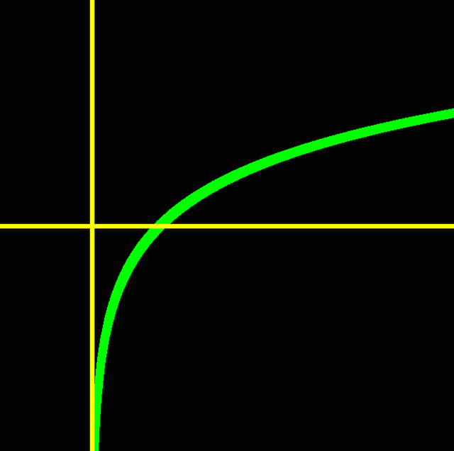

# Plot

## Authors

Created by Kirill Rodriguez somewhen between 2014-2015.

## Program

### Purpose

Tiny plotting utilities that are handy for visualising numbers and exploring mathematical functions.

### Description

#### illustrator

Plots a sequence of points from **stdin**.

#### graph

Plots a hardcoded function.

### Bugs / Errors

For problems on compilation or runtime stage you are always welcome to raise an issue.

### Contribution

In case you have a good suggestion, you are always welcome to make a pull request.

## Installation

### Prerequisites

* cmake
* make
* gcc/clang
* GLUT

### Compiling

	cmake . && make

## Usage

	./bin/illustrator # ( < file | <<EOF | <<< command ) stdin
	
----

	$EDITOR graph.cpp # edit calc function and char *function (function name) variable
	make
	./bin/graph

## Note

Use at own risk. Speed and convenience are the first priorities.