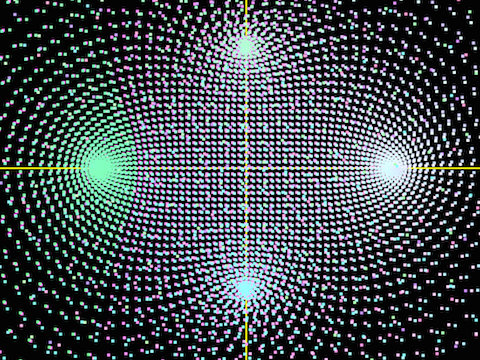

# Plot

## Authors

Created by Kirill Rodriguez somewhen between 2014-2015.

## Program

### Purpose

The whole program is a small mathematical playground visualising sequences, fractals, functions etc.

### Description

#### plot_fractal

Plots a fractal. Use `hjkl-=mM` to scale the view and the fractal itself.

Below is obtained illustration of mandelbrot set (aka **Julia set** with `F(z, c) = z * z + c`):

Some other fractals and, in particular, **Julia sets** are also available (try, for example, `f(z, c) = sin(z) + c`.

#### illustrator

Plots a sequence of points from **stdin** (above: prime number theorem illustration: `(pi(x) / (x / log(x)) - 1`, squeezed in width).

#### complex_in

Plots a sequence of set numbers (from **stdin**) on complex plane.

#### graph

Plots a hardcoded function (above: `log(n)`)

#### graph_i

Plots **f(z)** on complex plane where **z** is a complex number. It might behave weirdly because $$f(z) \in{G} \not\rightarrow z \in{G}$$ where **G** is the grid.

However, it still can give kind of understanding of function behaviour. Below is `cos(z) + sin(z)`:

#### gen/

The gen/ folder contains various generators, such as of some kinds of fractals, prime numbers etc. Those are to be piped to `illustrator` or `complex_in` programs for plotting as they are written to produce input following the necessary format.

### Bugs / Errors

For problems on compilation or runtime stage you are always welcome to raise an issue.

### Contribution

In case you have a good suggestion, a better implementation or something of your interest to add, you are always welcome to make a pull request.

## Installation

### Prerequisites

* cc
* OpenGL, GLUT
* cmake

### Compiling

	cmake . && make

## Usage

	# plots [i, a[i]] for a
	./bin/illustrator # ( < file | <<EOF | <<< command ) stdin
	
	# plots [re(a), im(a)] for a
		./bin/complex_in # ( < file | <<EOF | <<< command ) stdin
	
----

	# open (graph.cpp|graph_i.cpp|plot_fractal.cpp) and edit the macro
	make
	./bin/___ # execute

## Note

Use at own risk. Speed and convenience are the first priorities.